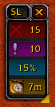

<h1>
    
    
&nbsp;

</h1>

> **A simple expereince tracking addon for World of Warcraft 1.17.1 Turlte WoW giving you the freedom of simplicity**
 <small>Not for Classic or Retail!.</small>

 
 

The goal of SimpleLvl is to allow the user the to  be able visualize the player
experience collected, vanilla is a long grind and sometimes you just want to be
able to keep track of when that next big golden glow is going to arrive. DING!!

Each element is designed to be simple, compact, and fit the wow theme asthetics.

 
 

## Installation

### Easy Update Options

* [GitAddonsManager](https://woblight.gitlab.io/overview/gitaddonsmanager/).
* TurtleWoW Launcher

### Manual

1. [Download SimpleLvl](https://github.com/Beardedrasta/SimpleLvl/archive/refs/heads/main.zip).
2. Extract the zip file to your addon directory `TurtleWoW\Interface\Addons`.
3. Rename the folder `SimpleLvl-main` folder to `SimpleLvl`.
4. Ensure the structure is `Interface\Addons\SimpleLvl\SimpleLvl.toc`. 

